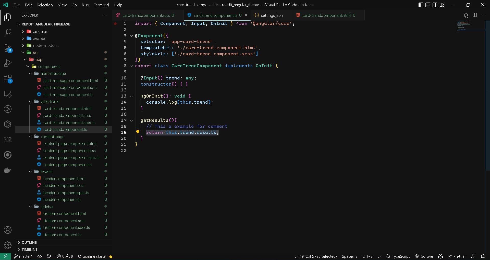

# Customize your theme in vs code

> select the default theme

```
control + shift + p
```

> open the setting.json

> and add the next code in your setting.json file

```json
{
  "editor.fontFamily": "Cascadia Code, 'Courier New', monospace",
  "editor.tokenColorCustomizations": {
    "comments": "#5563b1"
  },
  "workbench.colorCustomizations": {
    "statusBar.background": "#111",
    "activityBar.background": "#111",
    "sideBar.background": "#111",
    "list.hoverBackground": "#292929",
    "list.activeSelectionBackground": "#292929",
    "list.inactiveSelectionBackground": "#292929",
    "titleBar.activeBackground": "#111",
    "titleBar.inactiveBackground": "#111",
    "titleBar.inactiveForeground": "#fff",
    "scrollbarSlider.activeBackground": "#3ba3ed75",
    "scrollbarSlider.background": "#3ba3ed1c",
    "scrollbarSlider.hoverBackground": "#3ba3ed4d",
    "editorGroupHeader.tabsBackground": "#121212",
    "editorGroupHeader.noTabsBackground": "#121212",
    "tab.activeBackground": "#121212",
    "tab.inactiveBackground": "#191919",
    "tab.inactiveForeground": "#fff",
    "tab.activeForeground": "#fff",
    "tab.hoverBackground": "#181818",
    "tab.unfocusedHoverBackground": "#181818",
    "tab.unfocusedActiveBackground": "#121212",
    "tab.unfocusedActiveForeground": "#fff",
    "tab.unfocusedInactiveForeground": "#fff",
    "tab.unfocusedInactiveBackground": "#191919",
    "tab.unfocusedInactiveBorderTop": "#7ce1e7",
    "tab.unfocusedHoverBorder": "#7ce1e7",
    "tab.hoverBorder": "#7ce1e7",
    "tab.activeBorder": "#7ce1e7",
    "editor.background": "#131313",
    "editor.foreground": "#fff",
    "editorLineNumber.foreground": "#b0b0b0",
    "editorLineNumber.activeForeground": "#fff",
    "editorCursor.foreground": "#fff",
    "editor.selectionBackground": "#3ba3ed4d",
    "editor.selectionHighlightBackground": "#3ba3ed1c",
    "editor.wordHighlightBackground": "#3ba3ed1c",
    "editor.wordHighlightStrongBackground": "#3ba3ed1c",
    "editor.findMatchBackground": "#3ba3ed4d",
    "editor.findMatchHighlightBackground": "#3ba3ed1c",
    "editor.findRangeHighlightBackground": "#3ba3ed1c",
    "editor.hoverHighlightBackground": "#3ba3ed1c",
    "editorLink.activeForeground": "#7ce1e7",
    "editorBracketMatch.background": "#3ba3ed1c",
    "editorBracketMatch.border": "#3ba3ed75",
    "editorOverviewRuler.border": "#3ba3ed75",
    "editorOverviewRuler.findMatchForeground": "#3ba3ed75",
    "editorOverviewRuler.rangeHighlightForeground": "#3ba3ed75",
    "editorOverviewRuler.selectionHighlightForeground": "#3ba3ed75",
    "editorOverviewRuler.wordHighlightForeground": "#3ba3ed75",
    "editorOverviewRuler.wordHighlightStrongForeground": "#3ba3ed75",
    "editorOverviewRuler.modifiedForeground": "#3ba3ed75",
    "editorOverviewRuler.addedForeground": "#3ba3ed75",
    "editorOverviewRuler.deletedForeground": "#3ba3ed75",
    "editorOverviewRuler.errorForeground": "#3ba3ed75",
    "editorOverviewRuler.warningForeground": "#3ba3ed75",
    "editorOverviewRuler.infoForeground": "#3ba3ed75",
  }
}
```

### The Final Result is



***
also you can select other themes and customize your editor color in settings.json